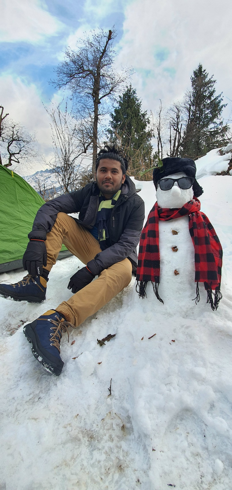

---
# You don't need to edit this file, it's empty on purpose.
# Edit theme's home layout instead if you wanna make some changes
# See: https://jekyllrb.com/docs/themes/#overriding-theme-defaults
layout: home
---

    

        
    

    

         
        
Hi, I'm <b><a href="https://www.linkedin.com/in/sangeetdas/">Sangeet Moy Das</a></b> and welcome to my blog!

        

            I currently work with the Innovation and Development (I&D) team of <b><a
            href="https://www.mu-sigma.com/">Mu Sigma Inc.</a></b> (world's largest pure-play data analytics firm), as an Data Scientist in their Algos team, where I primarily work on understanding and modelling complex dynamical systems. 
        

        

            Previously, I received my Bachelor's degree from <a
            href="https://www.soa.ac.in/">SOA University</a>. In this blog, I write about my interests in
            machine learning, software development, and research.
        

    

